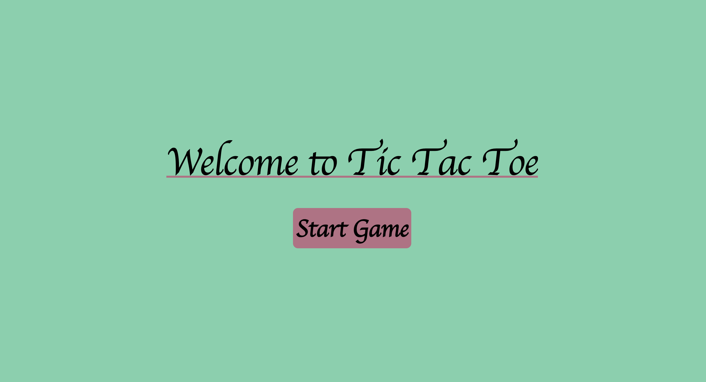
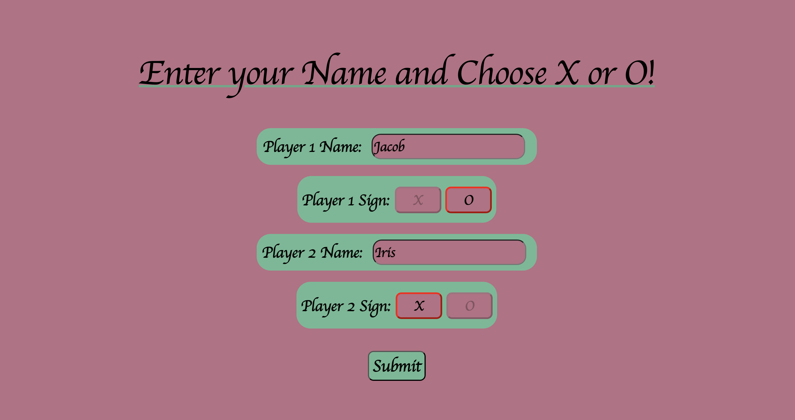
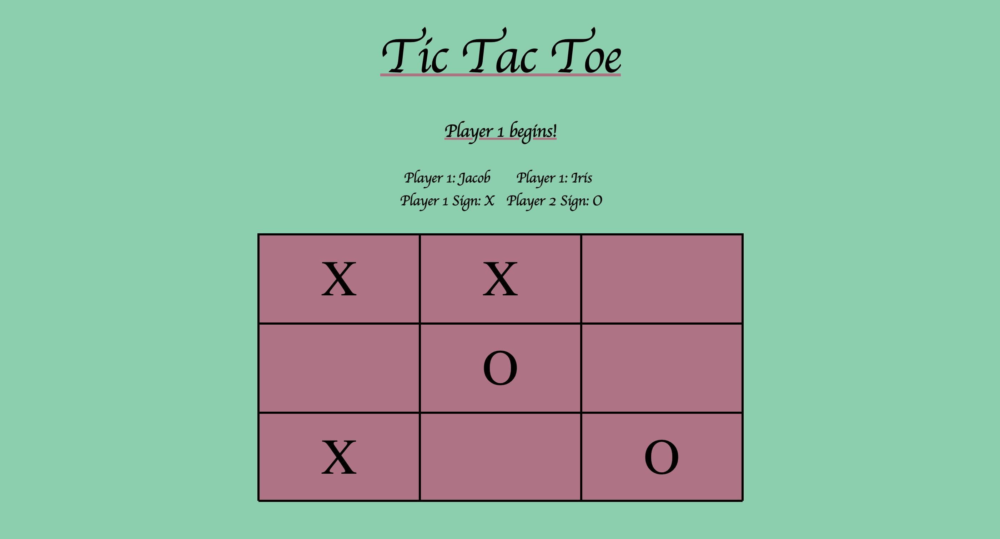

# Tic Tac Toe

I created a simple tic tac toe game which features two players.

# Key Features
- CSS Flexbox and Grid layouts for responsive design.
- There are a few page naviation going from the start of the game, to the player section and finally to the game section. 

# Usage
- Players start the game and enter their names and choose their symbol.
- After playing the game, a winner or a draw is declared.

# Technologies Used
- HTML5
- CSS3 (Flexbox & Grid)
- Javascript

# Screenshots
Here is a preview of the game

