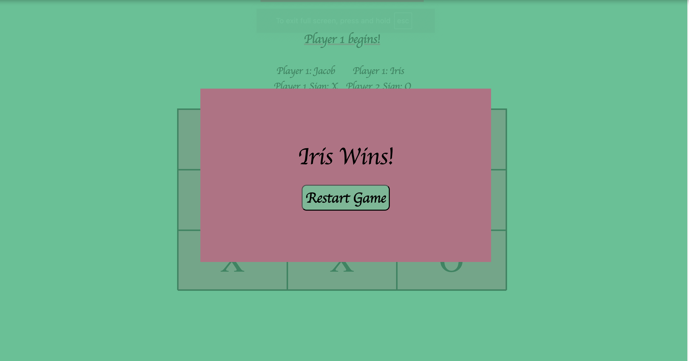

# Tic Tac Toe

I created a simple tic tac toe game which features two players.

## Live Demo

[**View the live project here**]( https://aimei60.github.io/tic-tac-toe/)

## Usage

- Players start the game and enter their names and choose their symbol.
- After playing the game, a winner or a draw is declared.

## Technologies Used

- HTML5
- CSS3 (Flexbox & Grid)
- Javascript

## What I Learned

- Practiced DOM manipulation and event handling to manage player moves.
- Learned how to track and update game variables, such as player turns (X and O) and win conditions.

## Preview

Here is a preview of the game

